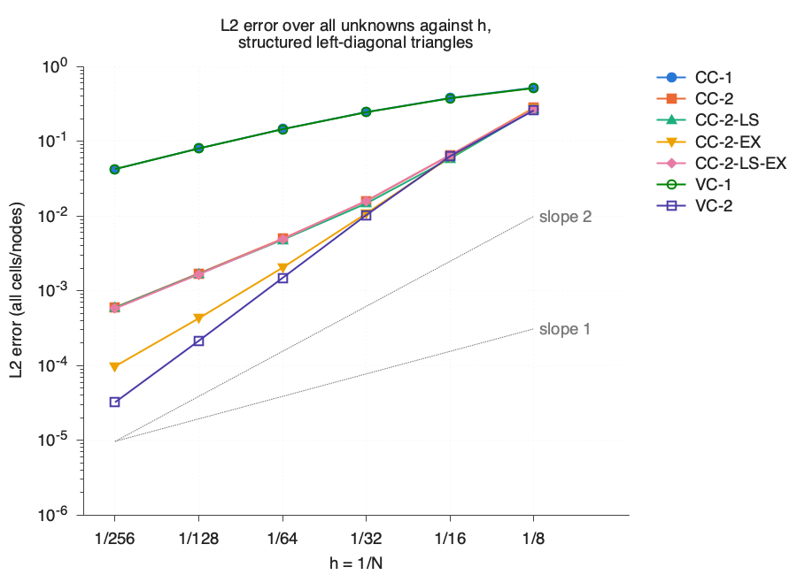
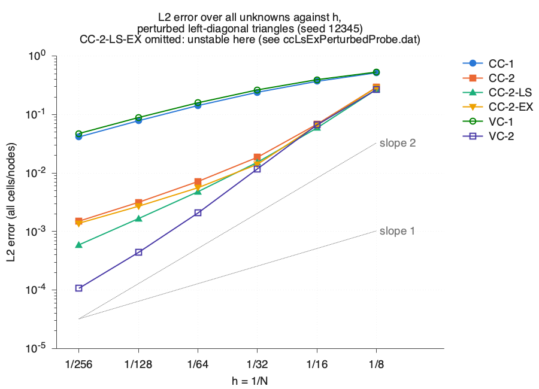
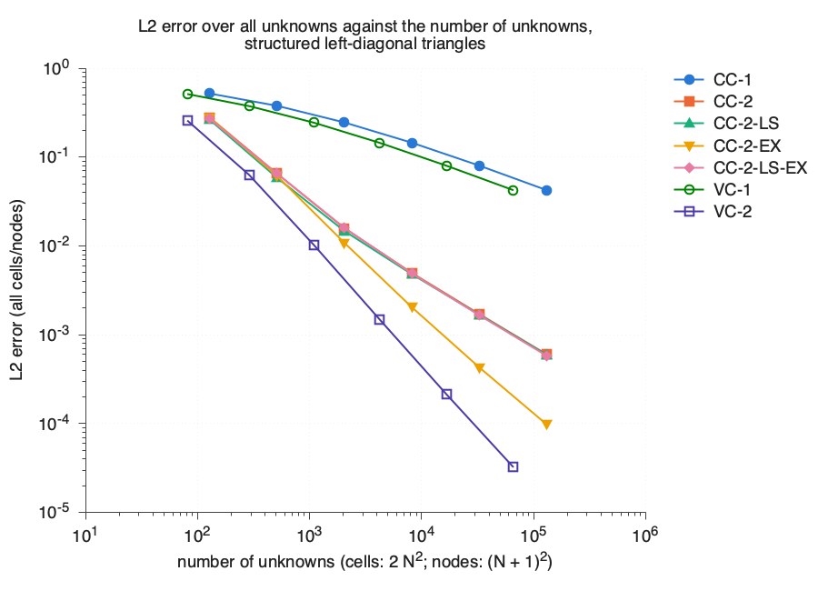
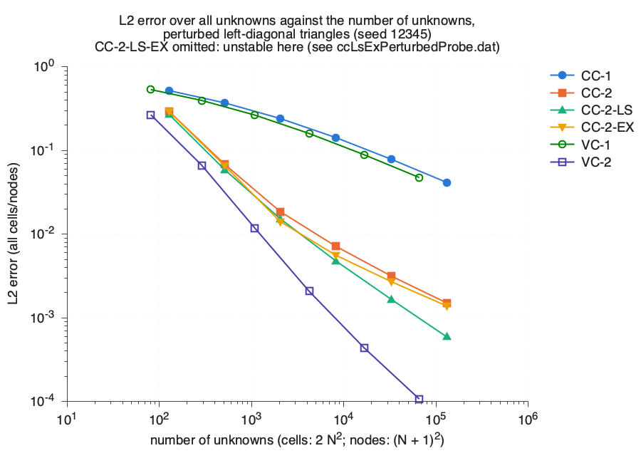
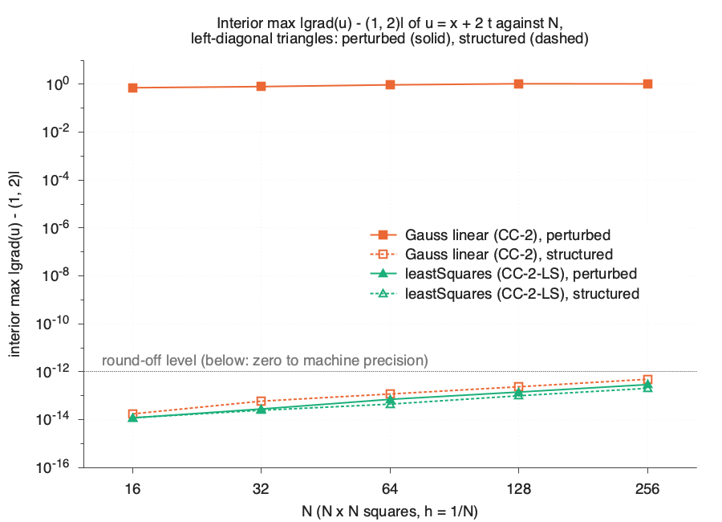
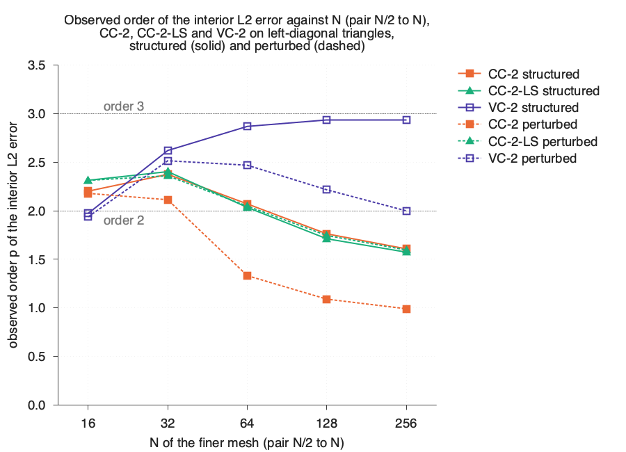

# Space-time finite volume methods in `spaceTime4foam`

This guide starts with a one-dimensional travelling wave and follows it
through the two discretisations in this repository: cell-centred finite
volume (CCFV) and vertex-centred finite volume (VCFV). The benchmark uses
one triangle mesh for both methods, so geometry and boundary treatment can
be examined alongside the usual error-versus-resolution comparison. The
current implementation and numerical evidence are for OpenFOAM.com v2412,
serial execution.

## 1. Why turn time into a coordinate?

An unsteady problem usually advances one spatial mesh through time. A
space-time method instead meshes a domain whose coordinates include time.
Here the plane has coordinates $(x,t)$: a triangle can span both a spatial
interval and a time interval. The resulting conservation law is steady on
that plane. OpenFOAM's `runTime` in `spaceTime4Foam` counts iterations of
the steady solver; it is **not** physical time. Physical time is mesh
coordinate `y`.

This view lets a finite volume method use the same flux balance across
spatial and temporal faces. It also admits meshes that are irregular in
space and time. This first benchmark isolates advection and asks how the
two placements of unknowns behave on structured and perturbed triangles.

## 2. Model problem and exact solution

On $0\leq x,t\leq1$, solve

$$
\frac{\partial u}{\partial t}+a\frac{\partial u}{\partial x}=0,
\qquad a=1.
$$

Along a characteristic $x(t)=x_0+at$, the total derivative is
$du/dt=u_t+a u_x=0$. Therefore the value is carried unchanged along a
line of constant $x-at$. For the initial wave
$u(x,0)=\sin(2\pi x)$, the solution is

$$
u_{\mathrm{exact}}(x,t)=\sin(2\pi(x-at)).
$$

At the left boundary, the inflow value must be
$u(0,t)=\sin(-2\pi at)$. In particular, its corner value agrees with
$u(0,0)$. Giving unrelated initial and left-boundary data would create
an incompatibility at that corner and would spoil a clean convergence
study. [`travellingSine.C`](../src/spaceTime4FoamModels/analyticalSolutions/travellingSine/travellingSine.C)
evaluates the same expression for the boundary data and error norms.

## 3. The steady space-time conservation law

Write $\boldsymbol{A}=(a,1)$, with components in $(x,t)$, and the
space-time flux $\boldsymbol{F}=\boldsymbol{A}u$. Since $\boldsymbol{A}$
is constant,

$$
\nabla_{x,t}\mathbin{\cdot}\boldsymbol{F}
=\frac{\partial(au)}{\partial x}
 +\frac{\partial u}{\partial t}=0.
$$

For a boundary with outward normal $\boldsymbol{n}$, data enter where
$\boldsymbol{A}\cdot\boldsymbol{n}<0$. On this square, `tStart` and
`xLeft` are inflow; `tEnd` and `xRight` are outflow. The initial condition
is thus an inflow boundary condition on the bottom edge of the space-time
mesh. The two outflow edges require no prescribed wave value.

The OpenFOAM mesh uses `x` for physical $x$, `y` for $t$, and a single
empty layer in `z`. The layer thickness is 1, so a CCFV cell volume equals
its triangle area and can be compared directly with the VCFV dual area.
All quantities are nondimensional here.

## 4. Cell-centred finite volume

For a space-time cell $K$, integration and the divergence theorem give

$$
\sum_{f\subset\partial K}
 (\boldsymbol{A}\cdot\boldsymbol{S}_f)u_f=0,
$$

where $\boldsymbol{S}_f$ is the outward face-area vector and $u_f$ is a
numerical face value. `CC-1` takes the upstream cell value. `CC-2` uses
OpenFOAM's `linearUpwind grad(u)` reconstruction; its gradient is
`Gauss linear`. `CC-2-LS` changes that gradient to `leastSquares`.
`CC-2-EX` and `CC-2-LS-EX` use the corresponding reconstruction and
`spaceTimeLinearExtrapolation` at the two outflows. The EX condition sets
$u_f=u_P+\nabla u_P\cdot(\boldsymbol{x}_f-\boldsymbol{x}_P)$ using the
**full** centroid-to-face vector. The standard `zeroGradient` outflow
instead gives $u_f=u_P$.

On rectangular cells aligned with $x$ and $t$, the temporal upwind flux
at the upper and lower faces and the spatial upwind flux give, for $a>0$,

$$
\Delta x(u_i^n-u_i^{n-1})
+a\Delta t(u_i^n-u_{i-1}^n)=0.
$$

After division by $\Delta x\Delta t$, this is backward Euler in time
and first-order upwind in space. The
[`ccfvBackwardEuler` test](../tests/ccfvBackwardEuler/Allrun) compares the
two implementations directly. Triangular space-time cells retain the
conservative face balance but do not amount to an ordinary sequence of
rectangular time steps.

[`cellCentred.C`](../src/spaceTime4FoamModels/spaceTimeModels/cellCentred/cellCentred.C)
creates $\boldsymbol{A}=(a,1,0)$, computes `phiST = fvc::flux(Ust)`, and
solves `fvm::div(phiST,u)`. Repeated solves provide deferred correction
for `linearUpwind`. The `PBiCGStab`/`DILU` settings are in
[`fvSolution`](../tutorials/advection1D/travellingSine/system/fvSolution).
The CCFV stopping measure is the initial residual of the latest linear
solve. `spaceTimeAnalyticalFixedValue` supplies the exact inflow face
values. Before output, `cellCentred::writeFields()` refreshes the
solution-dependent outflow patch values from the final converged cells.

The EX corner needs special care. On a Left mesh, the top-right cell has
two EX faces. Feeding those extrapolated values back into its gradient
creates a neutral mode with `Gauss linear` and a mode with gain 1.5 with
`leastSquares`; the residual may hide the latter. The default
`cornerFallback` uses $u_f=u_P$ on those two faces. The run checks that
there are two fallback faces on Left meshes and none on Right meshes.
For $a=1$, the corner cell value is unaffected. If $a\ne1$, this one
$O(h)$ fallback cell could limit $L_\infty$; taking its gradient from an
upwind neighbour is a candidate extension, not an implemented scheme.

## 5. Vertex-centred finite volume

### Median-dual geometry

VCFV stores one value at each node of the $(x,t)$ triangulation. Around
node $j$, the median dual joins triangle centroids to edge midpoints.
For triangle area $|T|$ and node position $\boldsymbol{p}_j$, the dual
area is

$$
V_j=\frac13\sum_{T\ni j}|T|.
$$

For edge $(j,k)$, orient the directed-area vector from lower node label
$j$ to higher label $k$. If $\boldsymbol{n}_j^T$ is the length-weighted
normal of the edge of triangle $T$ opposite $j$, directed away from $j$,
then

$$
\boldsymbol{n}_{jk}=\frac13\sum_{T\supset jk}
 \boldsymbol{n}_j^T
 +\begin{cases}
 \boldsymbol{n}_B/6,&jk\text{ is a boundary edge},\\
 0,&jk\text{ is interior}.
 \end{cases}
$$

$\boldsymbol{n}_B$ is the outward, length-weighted boundary normal.
The boundary term comes from the uncancelled half of the median-dual
face. The code checks the normal orientation with a dot product, so it
does not depend on Gmsh's face winding.

For the right triangle with nodes $(0,0)$, $(1,0)$ and $(0,1)$, its area
is $1/2$, so each dual area is $1/6$. The directed-area vector on the
edge from $(0,0)$ to $(1,0)$ is $(1/3,1/6)$. This small example is checked
by [`medianDualRightTriangle`](../tests/medianDualRightTriangle/Allrun).
For every node the geometric closure is

$$
\sum_k\boldsymbol{n}_{jk}
 +\frac12\sum_{B\ni j}\boldsymbol{n}_B=0.
$$

The factor $1/2$ assigns each boundary edge to its two endpoint nodes.
The area identity
$V_j=\frac14\sum_k(\boldsymbol{p}_k-\boldsymbol{p}_j)\cdot
\boldsymbol{n}_{jk}$ is also checked on full meshes.

### Reconstruction, flux and solution

`VC-1` uses the endpoint values directly. `VC-2` estimates an unweighted
least-squares gradient at node $j$ from its edge neighbours. With
$\boldsymbol{d}=\boldsymbol{p}_k-\boldsymbol{p}_j$, it reconstructs
$u_L=u_j+\tfrac12\nabla u_j\cdot\boldsymbol{d}$ and
$u_R=u_k-\tfrac12\nabla u_k\cdot\boldsymbol{d}$. Write
$\widehat{\boldsymbol{n}}_{jk}=\boldsymbol{n}_{jk}/
|\boldsymbol{n}_{jk}|$ and
$\lambda=\boldsymbol{A}\cdot\widehat{\boldsymbol{n}}_{jk}$. The
upwind flux per unit dual-face length is

$$
\phi_{jk}=\tfrac12\lambda(u_L+u_R)
-\tfrac12|\lambda|(u_R-u_L).
$$

For $\lambda>0$ this is $\lambda u_L$; for $\lambda<0$ it is
$\lambda u_R$. The single edge loop adds
$\phi_{jk}|\boldsymbol{n}_{jk}|$ to $\mathrm{Res}_j$ and subtracts it
from $\mathrm{Res}_k$. Equation 97 of Tufillaro et al. as printed has
the opposite sign on the dissipative term and would select the downwind
state; the implementation uses the upwind sign above.

In the benchmark, each boundary-edge endpoint gets a flux area of
$|\boldsymbol{n}_B|/2$. Its exterior state is the analytical value on
inflow and its own nodal value on outflow. This is the **weak** closure.
The paper's Table 2 reproduction instead fixes all boundary nodes to
the exact value (**strong** closure) and solves only interior nodes. For a
source problem, VCFV subtracts $f_jV_j$ from the residual, with
$f=\boldsymbol{A}\cdot\nabla u_{\mathrm{exact}}$; CCFV currently stops
if the selected exact solution has a nonzero source.

The steady residual is driven to zero by two-stage explicit Runge-Kutta
pseudo-time iteration. For unknown node $j$,

$$
\Delta\tau_j=\mathrm{CFL}\frac{V_j}{D_j},\qquad
D_j=\sum_k\tfrac12|\boldsymbol{n}_{jk}\cdot\boldsymbol{A}|,
\qquad \mathrm{CFL}=0.5.
$$

With weak closure, $D_j$ additionally includes
$\sum_{B\ni j}\tfrac14|\boldsymbol{n}_B\cdot\boldsymbol{A}|$ at a
boundary node. This differs from the paper's strong-boundary time step;
it changes the convergence path, not the residual's converged solution.
The stopping measure is the absolute RMS of $\mathrm{Res}_j/V_j$ over
unknown nodes, at most `1e-10` in the benchmark. An iteration-cap hit
exits nonzero. The solver writes a `pointScalarField`; front and back
points with the same $(x,t)$ receive the same value.

Because the CCFV and VCFV residual measures differ, their numerical
values cannot be compared as if they were the same stopping criterion.
[`iterationError`](../tests/iterationError/Allrun) tightens each by a
factor of 100 on an $N=64$ mesh and checks that every reported norm has
the same four significant digits.

### Published manufactured-solution check

[`tufillaroTable2`](../tests/tufillaroTable2/Allrun) builds the paper's
recursive meshes: 5, 13, 41, 145, 545 and 2113 nodes. It uses strong
Dirichlet data, VC-2 and the paper's nominal $h=2^{-n}$. For three
manufactured solutions, 17 of the 18 maximum-error values round to the
paper's three printed digits. The exception is the coarsest-mesh
quadratic $u_1=x^2+xy+y^2$: the converged discrete solution and an
independent closed-form check give exactly `0.55`, while the paper prints
`5.49e-1`. No single early stopping point reproduces all three printed
coarsest-mesh values. The hard test uses the closed form there and a 5%
comparison with the paper for meshes 1 to 5. The paper's $h$ and the
area-based $h\simeq0.707/2^n$ differ by a constant factor, so they give
the same orders.

## 6. Extending the mesh dimension

For a two-dimensional physical flow $(x,y)$, add time as the third mesh
coordinate $z=t$. The inviscid space-time velocity is
$(a_x,a_y,1)$; CCFV then integrates over ordinary three-dimensional
OpenFOAM cells. For VCFV on tetrahedra, the expected analogues are
$V_j=\frac14\sum_{T\ni j}|T|$ and
$\boldsymbol{n}_{jk}=\frac16\sum_{T\supset jk}\boldsymbol{n}_j^T$,
with an expected boundary correction coefficient of $1/12$. That
coefficient still needs a three-dimensional closure test before use.
Diffusion also needs attention on edges aligned with time: a spatial
gradient must not be inferred from a purely temporal edge. Padway and
Nishikawa discuss this time-aligned-edge issue. Neither diffusion nor
2D+t is implemented here.

For three physical spatial dimensions, the space-time mesh is four
dimensional and its simplices are pentatopes. Tufillaro et al. discuss
the potential edge-based storage advantage there: roughly 20 pentatopes
per node on the mesh family considered. That motivates future VCFV work;
it is not a measured cost advantage of this repository.

## 7. Code map and how to run it

| Data or operation | Implementation |
| --- | --- |
| Steady iteration, convergence exit and solver info | [`spaceTime4Foam.C`](../applications/solvers/spaceTime4Foam/spaceTime4Foam.C), [`writeSpaceTimeSolverInfo.H`](../applications/solvers/spaceTime4Foam/writeSpaceTimeSolverInfo.H) |
| Model selection, mesh, velocity and exact solution | [`spaceTimeModel`](../src/spaceTime4FoamModels/spaceTimeModels/spaceTimeModel/spaceTimeModel.C), [`newSpaceTimeModel.C`](../src/spaceTime4FoamModels/spaceTimeModels/spaceTimeModel/newSpaceTimeModel.C) |
| CCFV field, flux equation and final boundary refresh | [`cellCentred.C`](../src/spaceTime4FoamModels/spaceTimeModels/cellCentred/cellCentred.C) |
| VCFV edge residual, weak/strong closure and RK2 | [`vertexCentred.C`](../src/spaceTime4FoamModels/spaceTimeModels/vertexCentred/vertexCentred.C) |
| Front-patch triangles, dual geometry and nodal least squares | [`medianDualMesh.C`](../src/spaceTime4FoamModels/medianDualMesh/medianDualMesh.C) |
| Exact-solution selection and source evaluation | [`analyticalSolution.C`](../src/spaceTime4FoamModels/analyticalSolutions/analyticalSolution/analyticalSolution.C), [`newAnalyticalSolution.C`](../src/spaceTime4FoamModels/analyticalSolutions/analyticalSolution/newAnalyticalSolution.C), [`travellingSine.C`](../src/spaceTime4FoamModels/analyticalSolutions/travellingSine/travellingSine.C) |
| Other exact solutions for verification | [`constantSolution.C`](../src/spaceTime4FoamModels/analyticalSolutions/constantSolution/constantSolution.C), [`linearSolution.C`](../src/spaceTime4FoamModels/analyticalSolutions/linearSolution/linearSolution.C), [`mmsSymmetricQuadratic.C`](../src/spaceTime4FoamModels/analyticalSolutions/mmsSymmetricQuadratic/mmsSymmetricQuadratic.C), [`mmsQuadratic.C`](../src/spaceTime4FoamModels/analyticalSolutions/mmsQuadratic/mmsQuadratic.C), [`mmsExponential.C`](../src/spaceTime4FoamModels/analyticalSolutions/mmsExponential/mmsExponential.C) |
| CCFV inflow and outflow boundary conditions | [`spaceTimeAnalyticalFixedValue`](../src/spaceTime4FoamModels/boundaryConditions/spaceTimeAnalyticalFixedValue/spaceTimeAnalyticalFixedValueFvPatchScalarField.C), [`spaceTimeLinearExtrapolation`](../src/spaceTime4FoamModels/boundaryConditions/spaceTimeLinearExtrapolation/spaceTimeLinearExtrapolationFvPatchScalarField.C) |
| Perturbing interior points; error evaluation | [`perturbSpaceTimeMesh.C`](../applications/utilities/perturbSpaceTimeMesh/perturbSpaceTimeMesh.C), [`spaceTimeErrors.C`](../applications/utilities/spaceTimeErrors/spaceTimeErrors.C) |
| Mesh and benchmark sweep; tables and figures | [`Allmesh`](../tutorials/advection1D/travellingSine/Allmesh), [`Allrun`](../tutorials/advection1D/travellingSine/Allrun), [`makeTables`](../tutorials/advection1D/travellingSine/makeTables), [`plotConvergence.gp`](../tutorials/advection1D/travellingSine/plotConvergence.gp) |

Each class's neighbouring `.H` declares its interface and `TypeName`;
the `.C` defines behaviour and runtime registration. The model library's
[`Make/files.openfoam`](../src/spaceTime4FoamModels/Make/files.openfoam)
and application `Make/files` entries compile these sources. The model
and exact-solution `New` functions read the dictionary type names, so
changing a case's `spaceTimeModel` or `analyticalSolution` entry changes
the selected implementation without changing the solver executable.

The data path is: Gmsh triangle mesh to `gmshToFoam`; optional interior
point perturbation; `spaceTimeModel` selection from
[`spaceTimeProperties`](../tutorials/advection1D/travellingSine/constant/spaceTimeProperties);
CCFV cell field or VCFV front-patch nodes and dual geometry; steady
residual iteration; field output; `spaceTimeErrors`; one-line sweep
records; tables and figures. The selected gradient and divergence
schemes are in [`fvSchemes`](../tutorials/advection1D/travellingSine/system/fvSchemes),
and the CCFV patch types are in [`0/u`](../tutorials/advection1D/travellingSine/0/u).

On a machine with OpenFOAM.com v2412, Gmsh and gnuplot installed:

```bash
source /path/to/OpenFOAM-v2412/etc/bashrc
./Allwmake
./Alltest
./Alltest -full benchmarkRegression  # optional finest-pair check
cd tutorials/advection1D/travellingSine
./Allrun                              # complete S5 sweep
```

For a small single mesh, `./Allmesh 32 left perturbed 12345` creates it.
Set `spaceTimeModel` to `cellCentred` or `vertexCentred` in
`constant/spaceTimeProperties`, select the corresponding scheme in
`system/fvSchemes` for CCFV or reconstruction in
`vertexCentredCoeffs` for VCFV, then run `spaceTime4Foam` followed by
`spaceTimeErrors -nominalH 0.03125`. The full `Allrun` makes isolated
cases for every scheme and carries out convergence and mesh checks.
The generated data and image files are in
[`results/`](../tutorials/advection1D/travellingSine/results/manifest.dat);
the manifest records provenance. A partial `Allrun` writes to
`run/results/` by default, preserving the committed full-sweep results.

## 8. Verification before the benchmark

| Check | Test | Outcome |
| --- | --- | --- |
| CCFV backward Euler on quads | `ccfvBackwardEuler` | PASS |
| Right-triangle dual geometry | `medianDualRightTriangle` | PASS |
| Dual-area sum and closure | `medianDualIdentities` | PASS |
| Constant VCFV state | `vcfvFreestream` | PASS |
| Linear gradient and residual | `vcfvLinearExactness`, `vcfvResidual` | PASS |
| Paper's Table 2 | `tufillaroTable2` | PASS |

The full-mesh geometry test covers structured and perturbed meshes. The
Table 2 outcome includes the documented coarsest-mesh $u_1$ difference.

The complete `./Alltest` run passed 20 tests. It includes additional
tests of mesh import, perturbation, extrapolation, error weights,
gradient consistency, iteration error, solver control, table generation
and the N = 32 regression freeze. The optional finest-pair regression
also passed. See [the freeze review](audits/S5-freeze.md) and the earlier
[S4](audits/S4.md) and [S5](audits/S5.md) audits for the specific checks.

## 9. Benchmark: errors, orders and cost

The main mesh families contain $N\times N$ squares, each split along a
Left diagonal, for $N=8,16,32,64,128,256$. The perturbed family moves
interior vertices by at most $0.2h$ in both $x$ and $t$, keeps boundary
vertices fixed, and uses seed 12345. The two schemes share each triangle
mesh. CCFV has $2N^2$ cell unknowns; weak-closure VCFV has $(N+1)^2$
node unknowns. The area-based and nominal mesh sizes both equal $1/N$.

For a subset $S$ of cells or nodes, with error $e_q$ and its cell or dual
area $w_q$, the reported norms are

$$
L_1=\frac{\sum_{q\in S}w_q|e_q|}{\sum_{q\in S}w_q},\qquad
L_2=\sqrt{\frac{\sum_{q\in S}w_qe_q^2}{\sum_{q\in S}w_q}},\qquad
L_\infty=\max_{q\in S}|e_q|.
$$

Subsets are all, interior and boundary unknowns. At $t=T$, CCFV
compares face values at `tEnd` face centres, weighted by face length;
VCFV compares nodes on `tEnd`, weighted by half of each adjacent edge.
Observed order between successive meshes is
$p=\log(e_{\rm coarse}/e_{\rm fine})/
\log(h_{\rm coarse}/h_{\rm fine})$. The tables below use the finest
pair, $128\to256$, from
[`summary.dat`](../tutorials/advection1D/travellingSine/results/summary.dat).
The nominal theoretical order is 1 for CC-1/VC-1 and 2 for the other
schemes; boundary strips and mesh irregularity explain departures.

| Structured Left scheme | $p_{L_1}$ all | $p_{L_2}$ all | $p_{L_\infty}$ all |
| --- | ---: | ---: | ---: |
| CC-1 | 0.925 | 0.919 | 0.897 |
| CC-2 | 2.065 | 1.509 | 0.988 |
| CC-2-LS | 2.049 | 1.499 | 0.988 |
| CC-2-EX | 2.170 | 2.135 | 2.120 |
| CC-2-LS-EX | 2.049 | 1.517 | 1.001 |
| VC-1 | 0.924 | 0.918 | 0.891 |
| VC-2 | 2.966 | 2.732 | 2.001 |

| Perturbed Left scheme | $p_{L_1}$ all | $p_{L_2}$ all | $p_{L_\infty}$ all |
| --- | ---: | ---: | ---: |
| CC-1 | 0.928 | 0.920 | 0.904 |
| CC-2 | 1.041 | 1.068 | 0.934 |
| CC-2-LS | 2.021 | 1.491 | 1.038 |
| CC-2-EX | 0.994 | 0.965 | 0.826 |
| VC-1 | 0.913 | 0.906 | 0.868 |
| VC-2 | 2.079 | 2.035 | 2.167 |

There is no accepted CC-2-LS-EX row on perturbed meshes. Its bounded
stability probe, [`ccLsExPerturbedProbe.dat`](../tutorials/advection1D/travellingSine/results/ccLsExPerturbedProbe.dat),
converged in seven of 16 seed/mesh runs; nine did not converge or ended
with a floating-point failure. The growing error lay in an outflow strip,
on `tEnd` (four runs) or `xRight` (five runs), not in the interior. Probe
column 7 is the solver-loop time; a run that crashes before writing it
uses the measured elapsed time from column 20.





### The full first-order sequences

Each entry below is the observed $(L_1,L_2,L_\infty)$ order over **all**
unknowns. It reproduces every mesh pair from the four
[`orders_*.dat`](../tutorials/advection1D/travellingSine/results/orders_CC-1_leftStructured.dat)
files for CC-1 and VC-1 on the two main families.

| Pair | Struct. CC-1 | Struct. VC-1 | Pert. CC-1 | Pert. VC-1 |
| --- | --- | --- | --- | --- |
| 8→16 | .466/.460/.307 | .453/.452/.280 | .500/.488/.364 | .446/.432/.263 |
| 16→32 | .645/.623/.511 | .642/.618/.487 | .646/.620/.502 | .608/.581/.454 |
| 32→64 | .780/.759/.674 | .778/.756/.666 | .780/.757/.664 | .758/.731/.633 |
| 64→128 | .871/.856/.806 | .869/.855/.800 | .877/.862/.793 | .859/.842/.764 |
| 128→256 | .925/.919/.897 | .924/.918/.891 | .928/.920/.904 | .913/.906/.868 |

All four sequences rise towards first order. The roughly 0.92 finest
$L_2$ order is therefore pre-asymptotic: first-order numerical diffusion
still damps this travelling wave noticeably at $N=256$. It is not
evidence for a different asymptotic order.

### Accuracy per unknown

The following **$L_2$ ratios** use log interpolation of error against
unknown count within each method's measured mesh range. They come from
[`summary.dat`](../tutorials/advection1D/travellingSine/results/summary.dat)
and are regenerated by `bash docs/guideRatios`. The comparisons use
CC-2-EX on structured meshes and the best available CCFV variant,
CC-2-LS, on perturbed meshes. A ratio greater than 1 favours VC-2.

| Unknowns | Structured CC-2-EX / VC-2 | Perturbed CC-2-LS / VC-2 |
| ---: | ---: | ---: |
| 1,000 | 2.29 | 2.33 |
| 3,000 | 2.82 | 3.46 |
| 10,000 | 3.70 | 5.28 |
| 30,000 | 4.97 | 7.42 |
| 60,000 | 6.11 | 8.99 |

Thus the often quoted **about 6× structured and 9× perturbed** advantage
is a snapshot at about 60,000 unknowns, in $L_2$ only. The ratios grow
over the measured refinement range because the VC-2 $L_2$ slopes are
steeper. The underlying curves are shown in the
[structured](../tutorials/advection1D/travellingSine/results/figures/L2_vs_unknowns_leftStructured.png)
and [perturbed](../tutorials/advection1D/travellingSine/results/figures/L2_vs_unknowns_leftPerturbed.png)
per-unknown figures. The perturbed VC-2/CC-2-EX comparison would give a
different ratio and mix in the Gauss-gradient defect; CC-2-LS is the
appropriate available comparator there.





### Iterations and wall time are solver costs

At $N=256$, the [scheme tables](../tutorials/advection1D/travellingSine/results/manifest.dat)
record the following iteration-loop times from the clean S5 re-sweep:

| Family and scheme | Unknowns | Iterations | Solver-loop wall time (s) |
| --- | ---: | ---: | ---: |
| Structured CC-2-EX | 131,072 | 84 | 0.641 |
| Structured VC-2 | 66,049 | 1,106 | 3.631 |
| Perturbed CC-2-LS | 131,072 | 96 | 0.679 |
| Perturbed VC-2 | 66,049 | 1,138 | 3.655 |

These are measured costs of **different solvers**: implicit linear
solves with deferred correction for CCFV, explicit RK2 pseudo-time for
VCFV. Their stopping residuals also differ. They do not reverse the
accuracy-per-unknown finding, which concerns the discretisation. A
defect-correction VCFV solver with a first-order Jacobian could change
iterations and wall time while retaining the same converged VC-2
accuracy; it has not been implemented or timed here. The
[iteration](../tutorials/advection1D/travellingSine/results/figures/iterations_vs_N_leftStructured.png)
and [wall-time](../tutorials/advection1D/travellingSine/results/figures/wallTime_vs_N_leftStructured.png)
figures should be read as solver-cost measurements.

## 10. Why some orders differ from theory

### Outflow strips and evaluation locations

For `linearUpwind` on a non-coupled `zeroGradient` face, OpenFOAM adds no
reconstruction correction, so $u_f=u_P$. An $O(h)$ face-value error in
the $O(h)$-wide outflow strip predicts $L_1\sim h^2$,
$L_2\sim h^{3/2}$ and $L_\infty\sim h$. Structured CC-2 gives
2.065/1.509/0.988 on the finest pair, close to that signature. The EX
outflow condition removes it for Gauss on structured meshes.

CC-2-LS-EX still has a first-order outflow strip: OpenFOAM v2412's
`leastSquares` boundary gradient uses only the patch-normal part of its
boundary offset, whereas EX uses the full centroid-to-face vector.
The two are not linearly consistent together. On Left structured meshes
the EX corner fallback also controls the largest final-time error:
at $N=32$, the top-right face has error
$\sin(\pi/32)\simeq0.0980$. The `TExtrap` maximum there is the fallback
face value, so that column does not describe a hypothetical run without
the fallback.

For each CCFV cell, the code compares its cell average with the exact
**point value at the centroid**. Smooth-field averaging differs from
the centroid point value by $O(h^2)$. This affects the interpretation of
fine details, but it does not alter the second-order conclusions. VCFV
compares a nodal value with the exact value at that node. Both methods'
area weights are directly comparable because the mesh thickness is 1.

The primary CCFV $t=T$ error uses the **written boundary value**: $u_P$
for `zeroGradient`, the extrapolated value for EX except on fallback
faces. The tables retain a separately evaluated extrapolated value and
the cell value. The extrapolated value is a postprocessed diagnostic for
non-EX schemes, not the face value their solve used.

### Perturbation and gradient consistency

The [gradient diagnostic](../tutorials/advection1D/travellingSine/results/figures/gradientConsistency.png)
applies the gradients to the exactly linear field $u=x+2t$ on the actual
meshes. On structured meshes, interior `Gauss linear` errors are at
round-off. On perturbed meshes, its interior maximum is 0.720, 0.804,
0.948, 1.056 and 1.042 from $N=16$ to 256; its interior RMS approaches
about 0.22. The error does not decrease. The underlying face interpolation
does not place the interpolated value at the face centroid on a skewed
triangle, so an $O(h)$ face-value error becomes an $O(1)$ gradient error
after division by cell area. That is why CC-2 and CC-2-EX fall to roughly
first order on perturbed meshes.

`leastSquares` is exact to round-off **in the interior** on both families.
Over all cells its maximum is $O(1)$ at boundary cells: 0.718 on each
structured diagnostic mesh and 1.164 to 1.333 on the perturbed meshes.
Its all-cell RMS decreases like $h^{1/2}$ because the affected strip
shrinks. This is the normal-only boundary-offset issue, checked by
[`gradientConsistency`](../tests/gradientConsistency/Allrun). Consequently,
perturbed CC-2-LS is second order in $L_1$ (2.021), but boundary-strip
limited in $L_2$ (1.491) and $L_\infty$ (1.038). The
[interior-order figure](../tutorials/advection1D/travellingSine/results/figures/interiorOrders_structuredVsPerturbed.png)
uses solid lines for structured and dashed lines for perturbed; several
CC-2-LS and structured CC-2 curves nearly overlap because their data
are close.





VC-2 shows interior and $t=T$ orders near 3 on structured meshes; its
interior $L_2$ order is 2.933 over $128\to256$. On perturbed meshes that
order falls towards 2 (2.000 on the same pair). This is structured-mesh
superconvergence, not a general third-order guarantee. A plausible
explanation is cancellation of leading errors on translation-invariant
stencils; the benchmark does not prove that mechanism.

### Seed and characteristic-alignment checks

The seed study uses 12345, 7 and 3 through $N=128$. For example, at
$N=128$, VC-2's relative range over the seeds is 1.3% in all-node
$L_1$ and 0.9% in all-node $L_2$, but 16.2% in boundary-node
$L_\infty$ and 5.6% in $t=T$ $L_1$. A single all-norm spread number
would hide this variation; the exact min, max and mean are in
[`seeds.dat`](../tutorials/advection1D/travellingSine/results/seeds.dat).

The small Right-diagonal family is an **alignment illustration**, not a
main convergence result. At $a=1$, $\boldsymbol{A}=(1,1)$ is parallel to
each Right diagonal, so its flux through that face is zero. CCFV copies
values along characteristic paths. Its `tEnd` face centres lie on the
characteristics carrying those copied values, and for $T=1$ the exact
wave repeats there; the CCFV $t=T$ errors are zero to about $10^{-13}$.
Cell centroids lie off those characteristic paths, so domain errors
remain nonzero. The corresponding $t=T$ orders are `nan` because they
would divide round-off-level errors. VCFV nodal $t=T$ values are not
generally exact in this Right family.

## 11. Use and next steps

CCFV is a natural choice when OpenFOAM's cell-centred operators and an
implicit solve are central to the application. On regular space-time
meshes, a consistent outflow reconstruction recovers second-order domain
accuracy. On irregular triangles, the tested `Gauss linear` gradient is
not consistent; `leastSquares` repairs the interior gradient but needs a
matching boundary and outflow treatment. A consistent CCFV gradient
and boundary closure is the next fair comparator.

VCFV is attractive when accuracy per unknown and edge-based assembly on
irregular simplices matter. The tested VC-2 reconstruction stays near
second order on the perturbed family, but its explicit pseudo-time solve
is relatively costly at fine resolution. A defect-correction solver is a
separate performance task. Before extending to diffusion or 2D+t, verify
the tetrahedral boundary geometry and address time-aligned edges.

## 12. References and reproducibility

- Tufillaro, N., Williams, D. M. and Nishikawa, H., "Edge-Based
  Discretizations on Triangulations in Any Dimension, With Special
  Attention to Four-Dimensional Space," *International Journal for
  Numerical Methods in Fluids* (2026), doi:10.1002/fld.70084. Local copy:
  `refs/TufillaroWilliamsNishikawa.pdf`.
- Padway, E. and Nishikawa, H., "An Adaptive Space-Time Edge-Based Solver
  for Two-Dimensional Unsteady Viscous Flows," AIAA SciTech (2022).
  Local copy: `refs/PadwayNishikawa.pdf`.
- Katz, A. and Sankaran, V., *Journal of Computational Physics* 230
  (2011), 7670-7686; Diskin, B. and Thomas, J. L., AIAA Paper
  2012-0609. Tufillaro et al. list these as mesh-quality context; they
  are not local references and no numerical claim here is attributed to
  them.

All benchmark numbers in this guide are generated by the repository:
`./Allrun` produces the `.dat` files and figures; `bash docs/guideRatios`
prints the matched-unknown ratio table from `summary.dat`;
`./Alltest` reproduces the verification checks and N = 32 freeze; and
`./Alltest -full benchmarkRegression` checks the finest-pair orders.
See [`results/manifest.dat`](../tutorials/advection1D/travellingSine/results/manifest.dat)
for the OpenFOAM version, seed and sweep provenance. The reference papers
and their local-file status are documented in [`refs/README.md`](../refs/README.md).
